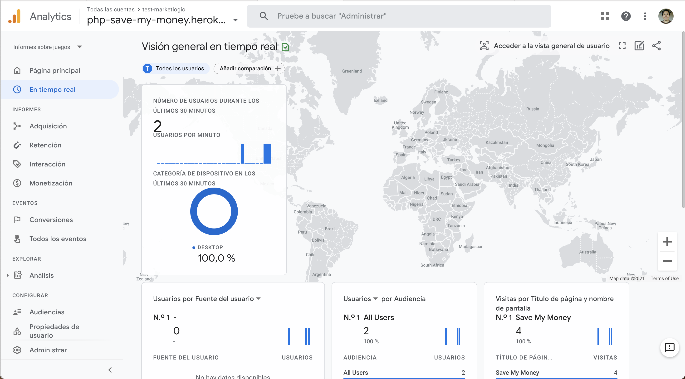

# SaveMyMoney

It is a basic site to save money from your friends.

## Use instruction

You have to enter names and amount of money from your friends and then click on the 'add' button to save it. To calculate the total amount received you have to click on 'Show saved money'.

## Technologies

Technologies used in this application:

- PHP 7.3.24 (Backend).
- Javascript (Frontend).
- MySQL 8.0.23 (Database).
- Google Analytics (Tracking websites).

## Pictures

- Sample of use:
<table><tr><td>
  
</td></tr></table>

- Analytics:
<table><tr><td>
  
</td></tr></table>
